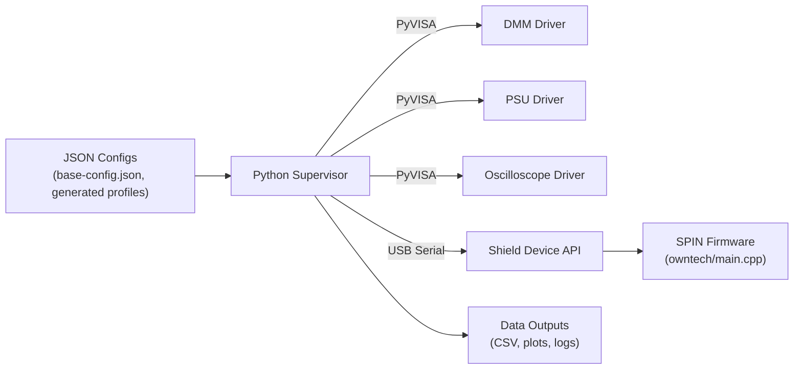

# LAAS-LAPLACE Test Bench Overview

This documentation set describes how the automated power test bench is assembled from configuration assets, Python supervisors, instrument drivers, communication layers, and firmware. The project is structured for experimentation with different sweep profiles and hardware targets while keeping the supervisory logic reusable.

## Repository Structure (High Level)

- `supervisor_v2_2.py` orchestrates test sequences, consuming JSON configurations and driving every instrument.
- `lib/` contains reusable instrument drivers (power supply, digital multimeters, oscilloscope) and plotting helpers.
- `comm_protocol/` covers SPIN board discovery plus the Shield device abstraction built on top of USB and serial links.
- `owntech/` holds the firmware that runs on the SPIN board and reacts to supervisor commands.
- `InitZplus_V5.py`, `Opposition_GenerateJson_v1_4.py`, and related scripts generate configuration files and provide CLI utilities for operators.
- `base-config.json` captures device addresses and default sweep parameters used as input by generation scripts.

## Control and Data Flow

## Documentation Map

- [Supervisor](supervisor.md) – internals of the orchestration class.
- [Configuration](configuration.md) – how base and generated JSON files control test runs.
- [Instrument Drivers](instrument-drivers.md) – reusable hardware abstractions under `lib/`.
- [Communication Protocol](comm-protocol.md) – Shield device API and supporting utilities.
- [Firmware Integration](firmware-integration.md) – PlatformIO project overview.
- [Operations](operations.md) – how to run sweeps, collect data, and automate workflows.
- [Troubleshooting](troubleshooting.md) – common issues and recovery steps.

Use this overview as a starting point before diving into more detailed documents.
