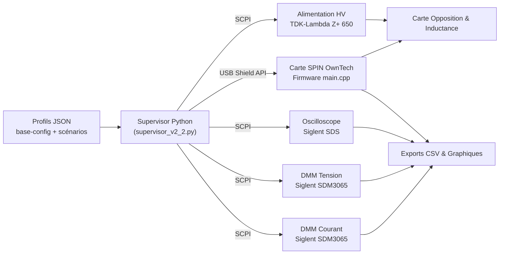

# Sommaire

I. BRÈVE DESCRIPTION DU PROJET SCIENTIFIQUE  
II. OBJECTIFS SCIENTIFIQUES  
III. CAHIER DES CHARGES  
IV. SYNOPTIQUE DU DISPOSITIF ÉLECTRONIQUE  
V. PARTIE MATÉRIELLE – HARDWARE  
VI. PARTIE LOGICIELLE  
VII. TESTS & RÉGLAGES  
VIII. SPÉCIFICATIONS  
IX. LIVRABLES HARDWARE ET SOFTWARE

# I. BRÈVE DESCRIPTION DU PROJET SCIENTIFIQUE

Le banc d’essai LAAS–LAPLACE automatise la caractérisation d’un module « Opposition » composé de deux demi-ponts alimentés par un bus continu et commandés par un générateur PWM SPIN. Le superviseur Python (`supervisor_v2_2.py`) orchestre la mise sous tension, les balayages de déphasage et/ou de rapport cyclique et la collecte des données issues des multimètres numériques (DMM), de l’oscilloscope et du convertisseur OwnTech. La finalité est de qualifier, dès le laboratoire, les couples inductance/résistance qui garantissent un transfert d’énergie fiable avant l’intégration dans les démonstrateurs hydrogène.

# II. OBJECTIFS SCIENTIFIQUES

- Qualifier la réponse du module Opposition pour différentes tensions et courants afin d’identifier les zones sûres d’exploitation.  
- Vérifier la cohérence des lois de commande (phase shift et duty sweep) implémentées dans le firmware SPIN (`owntech/main.cpp`).  
- Capturer les grandeurs électriques (bus DC, courant, PWM, température) avec une résolution suffisante pour alimenter les modèles MATLAB/Simulink utilisés par l’équipe.  
- Fournir un jeu de données reproductible (CSV + graphiques) permettant de recalibrer les modèles électromagnétiques et les protections matérielles.

# III. CAHIER DES CHARGES

## Descriptif fonctionnel

Le banc doit :

- Accepter des scénarios de tests décrits par fichiers JSON (`base-config.json` + profils générés).  
- Initialiser chaque instrument via PyVISA (`open_all_devices()`), vérifier leur identité et propager les limites de sécurité (`VoltageLimit`, `CurrentLimit`).  
- Commander le SPIN via `Shield_Device` (USB) pour appliquer des déphasages 0–180° et des rapports cycliques 10–48,5 %.  
- Mesurer simultanément la tension bus, le courant bus et la tension de sortie des cellules via deux DMM Siglent SDM3065 et un oscilloscope Siglent SDS (mode History/Sequence).  
- Exporter automatiquement les buffers DMM (`dmm_get_buffer`) et les captures oscilloscopes (`oscilloscope_save_data_all_channels`) vers le dossier `dataOutputFolder` horodaté.

## Descriptif matériel

| Sous-système | Matériel principal | Interface & remarques |
|--------------|-------------------|-----------------------|
| Alimentation HV | TDK-Lambda Z+ 650 (ou équivalent) | Contrôlé en SCPI via port série `ASRL/dev/ttyACM0`. Balayage 0–100 V géré par `power_supply_voltage_ramp_up/down`. |
| Mesure courant | Siglent SDM3065 (mode courant) | VISA TCP/IP `TCPIP0::169.254.126.119`. Buffer lu en fin de séquence. |
| Mesure tension | Siglent SDM3065 (mode tension) | VISA TCP/IP `TCPIP0::169.254.126.120`. Synchronisé avec le courant pour corrélation. |
| Oscilloscope | Siglent SDS2000X Plus (piloté par `lib/Oscillo_v1b.py`) | Acquisition segmentée, mesures automatiques configurées depuis `ScopeAutoMeasure`. |
| Générateur PWM | Carte SPIN OwnTech + Shield USB | Firmware `owntech/main.cpp` reçoit les commandes `microcontroller_send_command` pour fréquence (80–125 kHz), deadtime (100–2000 ns), phase shift. |
| DUT | Carte Opposition (double demi-pont et inducteur externe) | Reliée aux instruments via borniers Kelvin et capteurs OwnTech (tension/courant/thermique). |
| Infrastructure | PC de supervision + scripts Python | Héberge `supervisor_v2_2.py`, drivers dans `lib/`, notebooks d’analyse. |


# IV. SYNOPTIQUE DU DISPOSITIF ÉLECTRONIQUE

Le flux fonctionnel suit le diagramme ci-dessous : les fichiers de configuration alimentent le superviseur qui ouvre les instruments, pilote le SPIN et consigne les mesures. Le firmware retransmet son état (GPIO, mesures internes) via USB, ce qui maintient la cohérence entre commandes et effet matériel. Les DMM sont dédiés aux mesures DC tandis que l’oscilloscope capture les transitoires PWM et sert de référence fréquence/amplitude.



# V. PARTIE MATÉRIELLE – HARDWARE

## Partie matérielle électronique — instrumentation

1\) **Pré-étude et configuration**  
Les scripts `Opposition_GenerateJson_v1_4.py` et `InitZplus_V5.py` génèrent les profils de tests en fonction de `base-config.json`. Les constantes physiques (résistance totale 0,59 Ω, inductance 50 µH) sont injectées dans les JSON pour paramétrer les rampes et les calculs d’énergie.  

2\) **Cartes et instruments supervisés**

a) **Chaîne alimentation** — `power_supply_output_change()` assure la mise sous/hors tension en respectant les délais (`delay`, `delay2`). Les rampes sont subdivisées en pas (`voltage_step` = 4 V) pour limiter les à-coups.  

b) **Chaîne mesure DC** — `dmm_setup()` configure les deux SDM3065 (mode NPLC élevé pour le courant continu, trigger software pour la tension). Les commandes SCPI sont empaquetées par `dmm_send_cmd`.  

c) **Chaîne oscilloscope** — `oscilloscope_setup()` appelle `controloscillo.ConfigSequence` pour stocker `Sequence` segments. Les mesures avancées (fréquence, amplitude) sont ajoutées via `ScopeAutoMeasure`.  

d) **Chaîne microcontrôleur** — `microcontroller_setup()` découvre le port série (`find_devices`). Les commandes telles que `set_pwm_frequency`, `set_phase_shift` ou `start_pwm` sont envoyées par `microcontroller_send_command`, qui s’aligne sur les états du firmware (`loop_application_task()` dans `owntech/main.cpp`).  

e) **DUT & capteurs** — La carte Opposition embarque les sondes OwnTech (tension/courant/thermique). Les mesures analogiques sont empaquetées et remontent durant `POWER_ON`. L’inductance et les résistances shunt sont interchangeables pour répliquer différents cas de puissance.

## Partie matérielle mécanique — intégration

1\) **Disposition physique**  
Les instruments SCPI sont regroupés sur un rack 19" tandis que la carte Opposition, l’inductance et la carte SPIN reposent sur un plan isolant. Des borniers bananes et BNC répartissent les voies vers les DMM et l’oscilloscope. Les capteurs OwnTech sont connectés par nappes pour réduire les boucles de masse.  

2\) **Interfaçage utilisateur**  
La face avant du banc regroupe : interrupteur secteur, afficheur tension/courant du PSU, connecteurs pour l’inductance et le DUT, ports USB dédiés PC ↔ SPIN ↔ instruments. Tous les câbles sont étiquetés suivant les profils JSON pour éviter les inversions lors des reconfigurations.


# VI. PARTIE LOGICIELLE

## Pile logicielle et dépendances

| Composant | Rôle | Remarques de compatibilité |
|-----------|------|---------------------------|
| Python 3.10+ | Langage principal des scripts (`supervisor_v2_2.py`, outils CLI) | Disponible sur Windows, Linux et Raspberry Pi OS (ARM). |
| `pyvisa`, `pyvisa-py` | Couche SCPI multi-instruments | `pyvisa-py` suffit si NI-VISA n’est pas installé ; sur Windows on peut utiliser NI-VISA pour de meilleures performances. |
| `pyserial` | Communication USB avec la carte SPIN via `Shield_Device` | Associer l’utilisateur au groupe série (`dialout`/`uucp`) sous Linux/RPi. |
| `numpy`, `matplotlib` | Traitement et visualisation des séries temporelles | Utilisés dans `plot_values`, notebooks d’analyse et scripts d’export. |
| `zeroconf`, `psutil` | Découverte réseau et supervision locale | Optionnels mais requis par certains utilitaires (`InitZplus_V5.py`). |

Des dépendances supplémentaires comme `pandas` ou Jupyter peuvent être ajoutées pour l’analyse, mais la base fonctionnelle correspond au contenu de `requirements.txt`.

## Procédure d’installation (environnement virtuel local)

1. **Prérequis communs**
   - Installer Git et Python >= 3.10.  
   - Installer un backend VISA :  
     - *Windows* : NI-VISA ou `pyvisa-py`.  
     - *Linux/Raspberry Pi* : `sudo apt install libusb-1.0-0`, puis `pip install pyvisa-py`. Ajouter l’utilisateur aux groupes `dialout` (ttyUSB/ACM) et `video` si l’oscilloscope est connecté via USB.  
   - Vérifier l’accès réseau aux instruments LAN (pare-feu autorisé).

2. **Cloner le dépôt**
   ```bash
   git clone https://github.com/.../test_bench_code.git
   cd test_bench_code
   ```

3. **Créer l’environnement virtuel**
   - *Linux / macOS / Raspberry Pi* :
     ```bash
     python3 -m venv .venv
     source .venv/bin/activate
     ```
   - *Windows PowerShell* :
     ```powershell
     py -3 -m venv .venv
     .\.venv\Scripts\Activate.ps1
     ```
   - *Windows CMD* :
     ```cmd
     py -3 -m venv .venv
     .venv\Scripts\activate.bat
     ```

4. **Installer les dépendances Python**
   ```bash
   pip install --upgrade pip
   pip install -r requirements.txt
   ```
   Sous Raspberry Pi, ajouter `--extra-index-url https://www.piwheels.org/simple` si vous souhaitez privilégier les roues optimisées ARM.

5. **Configurer les accès matériels**
   - Copier/adapter `base-config.json` avec les adresses VISA locales.  
   - Sous Linux/RPi, créer éventuellement une règle `udev` (ex. `/etc/udev/rules.d/99-spin.rules`) pour donner les droits à l’USB VID/PID du Shield, puis rebrancher la carte.

6. **Validation cross-platform**
   - `python -m pyvisa.info` pour vérifier la détection des instruments.  
   - `python InitZplus_V5.py list` pour s’assurer que le superviseur voit l’alimentation, les DMM et la carte SPIN.  
   - Lancer un test à vide : `python supervisor_v2_2.py parameters.json` (profil sécurisé) et confirmer que les CSV apparaissent dans `dataOutputFolder`.

Ces étapes fonctionnent sur Windows 10/11, distributions Linux (Ubuntu/Debian) et Raspberry Pi OS. Maintenir l’environnement en exécutant périodiquement `pip list --outdated` et en épinglant les versions critiques dans `requirements.txt`.

# VII. TESTS & RÉGLAGES

| Étape | Objectif | Implantation logicielle | Données générées |
|-------|----------|-------------------------|------------------|
| Mise sous tension contrôlée | Vérifier polarités, limiter l’inrush | `power_supply_voltage_ramp_up`, `microcontroller_setup` | Journal console + mesures PSU |
| Balayage phase shift | Cartographier P(V,I,φ) | `microcontroller_sweep_phase_shift` (0→180° pas 30°) | Buffer courant/tension, CSV timestampés |
| Balayage duty cycle | Identifier points de rendement max | `microcontroller_sweep_duty_shift` (10→48,5 %) | Séries DMM + captures OSC (6 segments) |
| Lecture oscillations haute fréquence | Corréler PWM ↔ courant | `oscilloscope_read_history_and_choose_to_save` | Fichiers `scope*.csv`, captures BMP |
| Ralenti & arrêt | Renvoyer à l’état sûr | `power_supply_voltage_ramp_down`, `microcontroller_send_command('stop_pwm')` | Rapport final + graphiques générés par `plot_values` |


Les réglages fins (NPLC des DMM, niveaux de déclenchement oscillo, limites courant PSU) sont conservés dans les JSON pour chaque profil. En cas d’écart, `dmm_abort_measure` et `close_all_devices` assurent la remise à zéro avant un nouveau test.

# VIII. SPÉCIFICATIONS

- Tension bus : 0–100 V (balayages typiques 40–60 V).  
- Limite courant PSU : 0,3 A (configurable).  
- Fréquence PWM : 80 kHz, 100 kHz ou 125 kHz (`frequencyPWM`).  
- Dead time : 100–2000 ns (`DeadTimePWM`, max firmware 2000).  
- Déphasage : 0–180° pas 30°.  
- Duty cycle : 10 % à 48,5 % (ajusté par Step 0,5–1 %).  
- Résolution DMM : 6,5 digits, mémorisation buffer 10 k points.  
- Acquisition oscilloscope : 6 segments minimum (`Sequence`), timebase 2 µs/div, trigger externe /5 à 0,7 V.  
- Capteurs firmware : tension/courant low-side, températures (T1/T2), delta tension par branche enregistrés à 10 kHz.

# IX. LIVRABLES HARDWARE ET SOFTWARE

**Matériels**

- Coffret rack contenant l’alimentation TDK-Lambda, deux DMM Siglent, l’oscilloscope Siglent SDS (ou équivalent) et l’infrastructure de câblage.  
- Carte Opposition, inductances interchangeables, résistances shunt et capteurs thermiques.  
- Carte SPIN OwnTech flashée avec `owntech/main.cpp` (profil Hackathon).  
- Faisceaux USB/LAN/bananes étiquetés, alimentation 24 V auxiliaire si nécessaire.

**Logiciels & données**

- `supervisor_v2_2.py` + scripts auxiliaires (`InitZplus_V5.py`, `Opposition_GenerateJson_v1_4.py`, `single_point_runner.py`) pour piloter les campagnes.  
- Drivers instruments (`lib/PSU.py`, `lib/DMM.py`, `lib/Oscillo_v1b.py`) et communication Shield (`comm_protocol/src`).  
- Firmware PlatformIO (`owntech/`) synchronisé avec la version de protocole documentée.  
- Configurations JSON (base + profils), répertoires d’export CSV/plots, notebooks d’analyse (`calculations/energy_analysis.ipynb`).  
- Documentation associée (`docs/overview.md`, `docs/supervisor.md`, `docs/instrument-drivers.md`, présent document) pour garantir la pérennité du banc.
